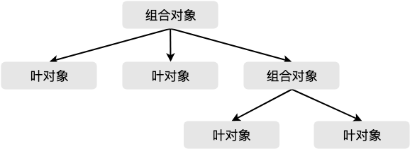

# 16 组合模式：文档结构树


能够生存下来的物种,并不是那些最强壮的,也不是那些最聪明的,而是那些对变化作出快速反应的。

——达尔文

**组合模式** （Composite Pattern）又叫整体-部分模式，它允许你将对象组合成树形结构来表现整体-部分层次结构，让使用者可以以一致的方式处理组合对象以及部分对象。

> **注意：** 本文可能用到一些 ES6 的语法 [Class](http://es6.ruanyifeng.com/#docs/class)、[let/const](http://es6.ruanyifeng.com/#docs/let)、[箭头函数](http://es6.ruanyifeng.com/#docs/function)、[rest 参数](http://es6.ruanyifeng.com/#docs/function) 等，如果还没接触过可以点击链接稍加学习 ~

1\. 你曾见过的组合模式
-------------

大家电脑里的文件夹结构相比很熟悉了，文件夹下面可以有子文件夹，也可以有文件，子文件夹下面还可以有文件夹和文件，以此类推，共同组成了一个文件树，结构如下：

```
Folder 1
├── Folder 2
│   ├── File 1.txt
│   ├── File 2.txt
│   └── File 3.txt
└── Folder 3
    ├── File 4.txt
    ├── File 5.txt
    └── File 6.txt

```

文件夹是树形结构的容器节点，容器节点可以继续包含其他容器节点，像树枝上还可以有其他树枝一样；也可以包含文件，不再增加新的层级，就像树的叶子一样处于末端，因此被称为叶节点。本文中，叶节点又称为叶对象，容器节点因为可以包含容器节点和非容器节点，又称为组合对象。

类似这样的结构还有公司的组织层级，比如企业下面可以有部门，部门有部门员工和科室，科室可以有科室员工和团队，团队下面又可以有团队员工和组，依次类推，共同组成完整的企业。还有生活中的容器，比如柜子可以直接放东西，也可以放盆，盆里可以放东西也可以放碗，以此类推。甚至我们的家庭结构也属于这种结构，祖父家庭有父亲家庭、伯伯家庭、叔叔家庭、姑姑家庭等，父亲家庭又有哥哥家庭、弟弟家庭，这也是很典型的整体-部分层次的结构。

当我们在某个文件夹下搜索某个文件的时候，通常我们希望搜索的结果包含组合对象的所有子孙对象；开家族会议的时候，开会的命令会被传达到家族中的每一个成员；领导希望我们 996 的时候，只要跟部门领导说一声，部门领导就会通知所有的员工来修福报，无论你是下属哪个组织的，都跑不掉…

在类似的场景中，有以下特点：

1.  结构呈整体-部分的树形关系，整体部分一般称为组合对象，组合对象下还可以有组合对象和叶对象；
2.  组合对象和叶对象有一致的接口和数据结构，以保证操作一致；
3.  请求从树的最顶端往下传递，如果当前处理请求的对象是叶对象，叶对象自身会对请求作出相应的处理；如果当前处理的是组合对象，则遍历其下的子节点（叶对象），将请求继续传递给这些子节点；

2\. 实例的代码实现
-----------

我们可以使用 JavaScript 来将之前的文件夹例子实现一下。

在本地一个「电影」文件夹下有两个子文件夹「漫威英雄电影」和「DC英雄电影」，分别各自有一些电影文件，我们要做的就是在这个电影文件夹里找大于 2G 的电影文件，无论是在这个文件夹下还是在子文件夹下，并输出它的文件名和文件大小。

```
/* 创建文件夹 */
var createFolder = function(name) {
    return {
        name: name,
        _children: [],
        
        /* 在文件夹下增加文件或文件夹 */
        add(fileOrFolder) {
            this._children.push(fileOrFolder)
        },
        
        /* 扫描方法 */
        scan(cb) {
            this._children.forEach(function(child) {
                child.scan(cb)
            })
        }
    }
}

/* 创建文件 */
var createFile = function(name, size) {
    return {
        name: name,
        size: size,
        
        /* 在文件下增加文件，应报错 */
        add() {
            throw new Error('文件下面不能再添加文件')
        },
        
        /* 执行扫描方法 */
        scan(cb) {
            cb(this)
        }
    }
}

var foldMovies = createFolder('电影')

// 创建子文件夹，并放入根文件夹
var foldMarvelMovies = createFolder('漫威英雄电影')
foldMovies.add(foldMarvelMovies)

var foldDCMovies = createFolder('DC英雄电影')
foldMovies.add(foldDCMovies)

// 为两个子文件夹分别添加电影
foldMarvelMovies.add(createFile('钢铁侠.mp4', 1.9))
foldMarvelMovies.add(createFile('蜘蛛侠.mp4', 2.1))
foldMarvelMovies.add(createFile('金刚狼.mp4', 2.3))
foldMarvelMovies.add(createFile('黑寡妇.mp4', 1.9))
foldMarvelMovies.add(createFile('美国队长.mp4', 1.4))

foldDCMovies.add(createFile('蝙蝠侠.mp4', 2.4))
foldDCMovies.add(createFile('超人.mp4', 1.6))

console.log('size 大于2G的文件有：')
foldMovies.scan(function(item) {
    if (item.size > 2) {
        console.log('name:' + item.name + ' size:' + item.size + 'GB')
    }
})

// size 大于2G的文件有：
// name:蜘蛛侠.mp4 size:2.1GB
// name:金刚狼.mp4 size:2.3GB
// name:蝙蝠侠.mp4 size:2.4GB

```

作为灵活的 JavaScript，我们还可以使用链模式来进行改造一下，让我们添加子文件更加直观和方便。对链模式还不熟悉的同学可以看一下后面有一篇单独介绍链模式的文章～

```
/* 创建文件夹 */
const createFolder = function(name) {
    return {
        name: name,
        _children: [],
        
        /* 在文件夹下增加文件或文件夹  */
        add(...fileOrFolder) {
            this._children.push(...fileOrFolder)
            return this
        },
        
        /* 扫描方法 */
        scan(cb) {
            this._children.forEach(child => child.scan(cb))
        }
    }
}

/* 创建文件 */
const createFile = function(name, size) {
    return {
        name: name,
        size: size,
      
        /* 在文件下增加文件，应报错 */
        add() {
            throw new Error('文件下面不能再添加文件')
        },
        
        /* 执行扫描方法 */
        scan(cb) {
            cb(this)
        }
    }
}

const foldMovies = createFolder('电影')
  .add(
    createFolder('漫威英雄电影')
      .add(createFile('钢铁侠.mp4', 1.9))
      .add(createFile('蜘蛛侠.mp4', 2.1))
      .add(createFile('金刚狼.mp4', 2.3))
      .add(createFile('黑寡妇.mp4', 1.9))
      .add(createFile('美国队长.mp4', 1.4)),
    createFolder('DC英雄电影')
      .add(createFile('蝙蝠侠.mp4', 2.4))
      .add(createFile('超人.mp4', 1.6))
  )

console.log('size 大于2G的文件有：')

foldMovies.scan(item => {
    if (item.size > 2) {
        console.log(`name:${ item.name } size:${ item.size }GB`)
    }
})

// size 大于2G的文件有：
// name:蜘蛛侠.mp4 size:2.1GB
// name:金刚狼.mp4 size:2.3GB
// name:蝙蝠侠.mp4 size:2.4GB

```

上面的代码比较 JavaScript 特色，如果我们使用传统的类呢，也是可以实现的，下面使用 ES6 的 class 语法来改写一下：

```
/* 文件夹类 */
class Folder {
    constructor(name, children) {
        this.name = name
        this.children = children
    }
    
    /* 在文件夹下增加文件或文件夹 */
    add(...fileOrFolder) {
        this.children.push(...fileOrFolder)
        return this
    }
    
    /* 扫描方法 */
    scan(cb) {
        this.children.forEach(child => child.scan(cb))
    }
}

/* 文件类 */
class File {
    constructor(name, size) {
        this.name = name
        this.size = size
    }
    
    /* 在文件下增加文件，应报错 */
    add(...fileOrFolder) {
        throw new Error('文件下面不能再添加文件')
    }
    
    /* 执行扫描方法 */
    scan(cb) {
        cb(this)
    }
}

const foldMovies = new Folder('电影', [
    new Folder('漫威英雄电影', [
        new File('钢铁侠.mp4', 1.9),
        new File('蜘蛛侠.mp4', 2.1),
        new File('金刚狼.mp4', 2.3),
        new File('黑寡妇.mp4', 1.9),
        new File('美国队长.mp4', 1.4)]),
    new Folder('DC英雄电影', [
        new File('蝙蝠侠.mp4', 2.4),
        new File('超人.mp4', 1.6)])
])

console.log('size 大于2G的文件有：')

foldMovies.scan(item => {
    if (item.size > 2) {
        console.log(`name:${ item.name } size:${ item.size }GB`)
    }
})

// size 大于2G的文件有：
// name:蜘蛛侠.mp4 size:2.1GB
// name:金刚狼.mp4 size:2.3GB
// name:蝙蝠侠.mp4 size:2.4GB

```

在传统的语言中，为了保证叶对象和组合对象的外观一致，还会让他们实现同一个抽象类或接口。

3\. 组合模式的概念
-----------

组合模式定义的包含组合对象和叶对象的层次结构，叶对象可以被组合成更复杂的组合对象，而这个组合对象又可以被组合，这样不断地组合下去。

在实际使用时，任何用到叶对象的地方都可以使用组合对象了。使用者可以不在意到底处理的节点是叶对象还是组合对象，也就不用写一些判断语句，让客户可以一致地使用组合结构的各节点，这就是所谓**面向接口编程**，从而减少耦合，便于扩展和维护。

组合模式的示意图如下：



4\. 实战中的组合模式
------------

类似于组合模式的结构其实我们经常碰到，比如浏览器的 DOM 树，从 `<html/>` 根节点到 `<head/>`、`<body/>`、`<style/>` 等节点，而 `<body/>` 节点又可以有 `<div/>`、`<span/>`、`<p/>`、`<a/>` 等等节点，这些节点下面还可以有节点，而且这些节点的操作方式有的也比较类似。

我们可以借用上面示例代码的例子，方便地创建一个 DOM 树，由于浏览器 API 的返回值不太友好，因此我们稍微改造一下；

```
const createElement = ({ tag, attr, children }) => {
    const node = tag
      ? document.createElement(tag)
      : document.createTextNode(attr.text)
    tag && Object.keys(attr)
      .forEach(key => node.setAttribute(key, attr[key]))
    children && children
      .forEach(child =>
        node.appendChild(createElement.call(null, child)))
    return node
}

const ulElement = createElement({
    tag: 'ul',
    attr: { id: 'data-list' },
    children: [
        {
            tag: 'li',
            attr: { class: 'data-item' },
            children: [{ attr: { text: 'li-item 1' } }]
        },
        {
            tag: 'li',
            attr: { class: 'data-item' },
            children: [{ attr: { text: 'li-item 2' } }]
        },
        {
            tag: 'li',
            attr: { class: 'data-item' },
            children: [{ attr: { text: 'li-item 3' } }]
        }
    ]
})

// 输出：
// <ul id='data-list'>
//     <li class='data-item'>li-item 1</li>
//     <li class='data-item'>li-item 2</li>
//     <li class='data-item'>li-item 3</li>
// </ul>

```

另外，之前的代码中添加文件的方式是不是很眼熟 ，Vue/React 里创建元素节点的方法 `createElement` 也是类似这样使用，来组装元素节点：

```
// Vue
createElement('h3', { class: 'main-title' }, [
    createElement('img', { class: 'avatar', attrs: { src: '../avatar.jpg' } }),
    createElement('p', { class: 'user-desc' }, '长得帅老的快，长得丑活得久')
])

// React
React.createElement('h3', { className: 'user-info' },
  React.createElement('img', { src: '../avatar.jpg', className: 'avatar' }),
  React.createElement('p', { className: 'user-desc' }, '长得帅老的快，长得丑活得久')
)

```

类似的，Vue 中的虚拟 DOM 树，也是这样的结构：

```
{
    tagName: 'ul',   // 节点标签名
    props: {         // 属性
        id: 'data-list'
    },
    children: [      // 节点的子节点
        {
            tagName: 'li',
            props: { class: 'data-item' },
            children: ['li-item 1']
        },
        {
            tagName: 'li',
            props: { class: 'data-item' },
            children: ['li-item 2']
        }, {
            tagName: 'li',
            props: { class: 'data-item' },
            children: ['li-item 3']
        }]
}

```

这样的虚拟 DOM 树，会被渲染成：

```
<ul id='data-list'>
    <li class='data-item'>li-item 1</li>
    <li class='data-item'>li-item 2</li>
    <li class='data-item'>li-item 3</li>
</ul>

```

虚拟 DOM 树中的每个虚拟 DOM 都是 `VNode` 类的实例，因此具有基本统一的外观，在操作时对父节点和子节点的操作是一致的，这也是组合模式的思想。

浏览器的 DOM 树、Vue 的虚拟 DOM 树等可以说和组织模式形似，也就是具有整体-部分的层次结构，但是在操作传递方面，没有组合模式所定义的特性。

这个特性就是**职责链模式**的特性，组合模式天生具有职责链，当请求组合模式中的组合对象时，请求会顺着父节点往子节点传递，直到遇到可以处理这个请求的节点，也就是叶节点。

5\. 组合模式的优缺点
------------

组合模式的优点：

1.  由于组合对象和叶对象具有同样的接口，因此调用的是组合对象还是叶对象对使用者来说没有区别，使得使用者**面向接口编程**；
2.  如果想在组合模式的树中增加一个节点比较容易，在目标组合对象中添加即可，不会影响到其他对象，**对扩展友好，符合开闭原则，利于维护**；

组合模式的缺点：

1.  增加了系统复杂度，如果树中对象不多，则不一定需要使用；
2.  如果通过组合模式创建了太多的对象，那么这些对象可能会让系统负担不起；

6\. 组合模式的适用场景
-------------

1.  如果对象组织呈树形结构就可以考虑使用组合模式，特别是如果操作树中对象的方法比较类似时；
2.  使用者希望统一对待树形结构中的对象，比如用户不想写一堆 `if-else` 来处理树中的节点时，可以使用组合模式；

7\. 其他相关模式
----------

### 7.1 组合模式和职责链模式

正如前文所说，组合模式是天生实现了职责链模式的。

1.  **组合模式：** 请求在组合对象上传递，被深度遍历到组合对象的所有子孙叶节点具体执行；
2.  **职责链模式：** 实现请求的发送者和接受者之间的解耦，把多个接受者组合起来形成职责链，请求在链上传递，直到有接受者处理请求为止；

### 7.2 组合模式和迭代器模式

组合模式可以结合迭代器模式一起使用，在遍历组合对象的叶节点的时候，可以使用迭代器模式来遍历。

### 7.3 组合模式和命令模式

命令模式里有一个用法「宏命令」，宏命令就是组合模式和命令模式一起使用的结果，是组合模式组装而成。
