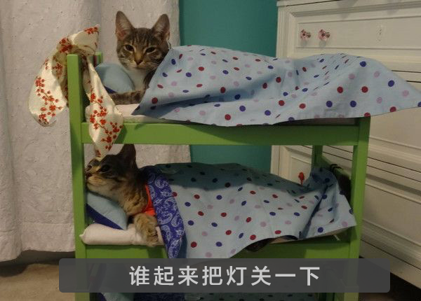
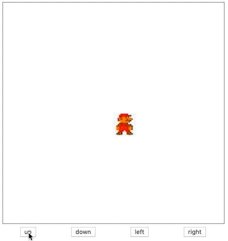
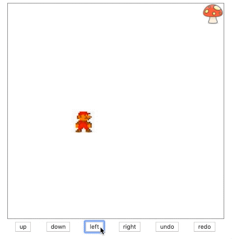

# 23 命令模式：江湖通缉令


世界上最宽阔的是海洋，比海洋更宽阔的是天空，比天空更宽阔的是人的胸怀。

——雨果

行为型模式：命令模式
==========

**命令模式** （Command Pattern）又称事务模式，将请求封装成对象，将命令的发送者和接受者解耦。本质上是对**方法调用的封装**。

通过封装方法调用，也可以做一些有意思的事，例如记录日志，或者重复使用这些封装来实现撤销（undo）、重做（redo）操作。

> **注意：** 本文可能用到一些 ES6 的语法 [let/const](http://es6.ruanyifeng.com/#docs/let) 、[Class](http://es6.ruanyifeng.com/#docs/class) 等，如果还没接触过可以点击链接稍加学习 ~

1\. 你曾见过的命令模式
-------------

某日，著名门派蛋黄派于江湖互联网发布江湖通缉令一张「通缉偷电瓶车贼窃格瓦拉，抓捕归案奖鸭蛋 10 个」。对于通缉令发送者蛋黄派来说，不需向某个特定单位通知通缉令，而通缉令发布之后，蛋黄派也不用管是谁来完成这个通缉令，也就是说，通缉令的发送者和接受者之间被解耦了。

大学宿舍的时候，室友们都上床了，没人起来关灯，不知道有谁提了一句「谁起来把灯关一下」，此时比的是谁装睡装得像，如果沉不住气，就要做命令的执行者，去关灯了。

  
比较经典的例子是餐馆订餐，客人需要向厨师发送请求，但是不知道这些厨师的联系方式，也不知道厨师炒菜的流程和步骤，一般是将客人订餐的请求封装成命令对象，也就是订单。这个订单对象可以在程序中被四处传递，就像订单可以被服务员传递到某个厨师手中，客人不需要知道是哪个厨师完成自己的订单，厨师也不需要知道是哪个客户的订单。

在类似场景中，这些例子有以下特点：

1.  命令的发送者和接收者解耦，发送者与接收者之间没有直接引用关系，发送请求的对象只需要知道如何发送请求，而不必知道如何完成请求；
2.  对命令还可以进行撤销、排队等操作，比如用户等太久不想等了撤销订单，厨师不够了将订单进行排队，等等操作；

2\. 实例的代码实现
-----------

为了方便演示命令的撤销和重做，下面使用 JavaScript 来实现对超级玛丽的操控 🤣。

### 2.1 马里奥的操控实现

首先我们新建一个移动对象类，在以后的代码中是通用的：

```
var canvas = document.getElementById('my-canvas')
var CanvasWidth = 400    // 画布宽度
var CanvasHeight = 400   // 画布高度
var CanvasStep = 40      // 动作步长
canvas.width = CanvasWidth
canvas.height = CanvasHeight

// 移动对象类
var Role = function(x, y, imgSrc) {
    this.position = { x, y }
    this.canvas = document.getElementById('my-canvas')
    
    this.ctx = this.canvas.getContext('2d')
    this.img = new Image()
    this.img.style.width = CanvasStep
    this.img.style.height = CanvasStep
    this.img.src = imgSrc
    this.img.onload = () => {
        this.ctx.drawImage(this.img, x, y, CanvasStep, CanvasStep)
        this.move(0, 0)
    }
}

Role.prototype.move = function(x, y) {
    var pos = this.position
    this.ctx.clearRect(pos.x, pos.y, CanvasStep, CanvasStep)
    pos.x += x
    pos.y += y
    this.ctx.drawImage(this.img, pos.x, pos.y, CanvasStep, CanvasStep)
}

```

下面如果要实现操控超级玛丽，可以直接：

```
var mario = new Role(200, 200, 'https://i.loli.net/2019/08/09/sqnjmxSZBdPfNtb.jpg')

// 设置按钮回调
var elementUp = document.getElementById('up-btn')
elementUp.onclick = function() {
    mario.move(0, -CanvasStep)
}

var elementDown = document.getElementById('down-btn')
elementDown.onclick = function() {
    mario.move(0, CanvasStep)
}

var elementLeft = document.getElementById('left-btn')
elementLeft.onclick = function() {
    mario.move(-CanvasStep, 0)
}

var elementRight = document.getElementById('right-btn')
elementRight.onclick = function() {
    mario.move(CanvasStep, 0)
}

```

可以实现下面这样的效果：

  
如果要新建一个小怪兽角色，可以：

```
var monster = new Role(160, 160, 'https://i.loli.net/2019/08/12/XCTzcdbhriLlskv.png')

```

代码和预览参见：[Codepen - 状态模式Demo1](https://codepen.io/SHERlocked93/pen/EqGwrm)

### 2.2 引入命令模式

上面的实现逻辑上没有问题，但当我们在页面上点击按钮发送操作请求时，需要向具体负责实现行为的对象发送请求操作，对应上面的例子中的 `mario`、`monster`，这些对象就是操作的接受者。也就是说，操作的发送者直接持有操作的接受者，逻辑直接暴露在页面 DOM 的事件回调中，耦合较强。如果要增加新的角色，需要对 DOM 的回调函数进行改动，如果对操作行为进行修改，对应地，也需修改 DOM 回调函数。

此时，我们可以引入命令模式，以便将操作的发送者和操作的接受者解耦。在这个例子中，我们将操作马里奥的行为包装成命令类，操作的发送者只需要持有对应的命令实例并执行，命令的内容是具体的行为逻辑。

多说无益，直接看代码（从这里之后就直接用 ES6）：

```
const canvas = document.getElementById('my-canvas')
const CanvasWidth = 400    // 画布宽度
const CanvasHeight = 400   // 画布高度
const CanvasStep = 40      // 动作步长
canvas.width = CanvasWidth
canvas.height = CanvasHeight

const btnUp = document.getElementById('up-btn')
const btnDown = document.getElementById('down-btn')
const btnLeft = document.getElementById('left-btn')
const btnRight = document.getElementById('right-btn')

// 移动对象类
class Role {
    constructor(x, y, imgSrc) {
        this.x = x
        this.y = y
        this.canvas = document.getElementById('my-canvas')
        this.ctx = this.canvas.getContext('2d')
        this.img = new Image()
        this.img.style.width = CanvasStep
        this.img.style.height = CanvasStep
        this.img.src = imgSrc
        this.img.onload = () => {
            this.ctx.drawImage(this.img, x, y, CanvasStep, CanvasStep)
            this.move(0, 0)
        }
    }
    
    move(x, y) {
        this.ctx.clearRect(this.x, this.y, CanvasStep, CanvasStep)
        this.x += x
        this.y += y
        this.ctx.drawImage(this.img, this.x, this.y, CanvasStep, CanvasStep)
    }
}

// 向上移动命令类
class MoveUpCommand {
    constructor(receiver) {
        this.receiver = receiver
    }
    
    execute(role) {
        this.receiver.move(0, -CanvasStep)
    }
}

// 向下移动命令类
class MoveDownCommand {
    constructor(receiver) {
        this.receiver = receiver
    }
    
    execute(role) {
        this.receiver.move(0, CanvasStep)
    }
}

// 向左移动命令类
class MoveLeftCommand {
    constructor(receiver) {
        this.receiver = receiver
    }
    
    execute(role) {
        this.receiver.move(-CanvasStep, 0)
    }
}

// 向右移动命令类
class MoveRightCommand {
    constructor(receiver) {
        this.receiver = receiver
    }
    
    execute(role) {
        this.receiver.move(CanvasStep, 0)
    }
}

// 设置按钮命令
const setCommand = function(element, command) {
    element.onclick = function() {
        command.execute()
    }
}

/* ----- 客户端 ----- */
const mario = new Role(200, 200, 'https://i.loli.net/2019/08/09/sqnjmxSZBdPfNtb.jpg')
const moveUpCommand = new MoveUpCommand(mario)
const moveDownCommand = new MoveDownCommand(mario)
const moveLeftCommand = new MoveLeftCommand(mario)
const moveRightCommand = new MoveRightCommand(mario)

setCommand(btnUp, moveUpCommand)
setCommand(btnDown, moveDownCommand)
setCommand(btnLeft, moveLeftCommand)
setCommand(btnRight, moveRightCommand)

```

代码和预览参见：[Codepen-状态模式Demo2](https://codepen.io/SHERlocked93/pen/YmMNXx)

我们把操作的逻辑分别提取到对应的 `Command` 类中，并约定 `Command` 类的 `execute` 方法存放命令接收者需要执行的逻辑，也就是前面例子中的 `onclick` 回调方法部分。

按下操作按钮之后**会发生事情**这个逻辑是不变的，而**具体发生什么事情**的逻辑是可变的，这里我们可以提取出公共逻辑，把一定发生事情这个逻辑提取到 `setCommand` 方法中，在这里调用命令类实例的 `execute` 方法，而不同事情具体逻辑的不同体现在各个 `execute` 方法的不同实现中。

至此，命令的发送者已经知道自己将会执行一个 `Command` 类实例的 `execute` 实例方法，但是具体是哪个操作类的类实例来执行，还不得而知，这时候需要调用 `setCommand` 方法来告诉命令的发送者，执行的是哪个命令。

综上，一个命令模式改造后的实例就完成了，但是在 JavaScript 中，命令不一定要使用类的形式：

```
// 前面代码一致

// 向上移动命令对象
const MoveUpCommand = {
    execute(role) {
        role.move(0, -CanvasStep)
    }
}

// 向下移动命令对象
const MoveDownCommand = {
    execute(role) {
        role.move(0, CanvasStep)
    }
}

// 向左移动命令对象
const MoveLeftCommand = {
    execute(role) {
        role.move(-CanvasStep, 0)
    }
}

// 向右移动命令对象
const MoveRightCommand = {
    execute(role) {
        role.move(CanvasStep, 0)
    }
}

// 设置按钮命令
const setCommand = function(element, role, command) {
    element.onclick = function() {
        command.execute(role)
    }
}

/* ----- 客户端 ----- */
const mario = new Role(200, 200, 'https://i.loli.net/2019/08/09/sqnjmxSZBdPfNtb.jpg')

setCommand(btnUp, mario, MoveUpCommand)
setCommand(btnDown, mario, MoveDownCommand)
setCommand(btnLeft, mario, MoveLeftCommand)
setCommand(btnRight, mario, MoveRightCommand)

```

代码和预览参见：[Codepen-状态模式Demo3](https://codepen.io/SHERlocked93/pen/LwrzJY)

### 2.3 命令模式升级

可以对这个项目进行升级，记录这个角色的行动历史，并且提供一个 `redo`、`undo` 按钮，撤销和重做角色的操作，可以想象一下如果不使用命令模式，记录的 Log 将比较乱，也不容易进行操作撤销和重做。

下面我们可以使用命令模式来对上面马里奥的例子进行重构，有下面几个要点：

1.  命令对象包含有 `execute` 方法和 `undo` 方法，前者是执行和重做时执行的方法，后者是撤销时执行的反方法；
2.  每次执行操作时将当前操作命令推入撤销命令栈，并将当前重做命令栈清空；
3.  撤销操作时，将撤销命令栈中最后推入的命令取出并执行其 `undo` 方法，且将该命令推入重做命令栈；
4.  重做命令时，将重做命令栈中最后推入的命令取出并执行其 `execute` 方法，且将其推入撤销命令栈；

```
// 向上移动命令对象
const MoveUpCommand = {
    execute(role) {
        role.move(0, -CanvasStep)
    },
    undo(role) {
        role.move(0, CanvasStep)
    }
}

// 向下移动命令对象
const MoveDownCommand = {
    execute(role) {
        role.move(0, CanvasStep)
    },
    undo(role) {
        role.move(0, -CanvasStep)
    }
}

// 向左移动命令对象
const MoveLeftCommand = {
    execute(role) {
        role.move(-CanvasStep, 0)
    },
    undo(role) {
        role.move(CanvasStep, 0)
    }
}

// 向右移动命令对象
const MoveRightCommand = {
    execute(role) {
        role.move(CanvasStep, 0)
    },
    undo(role) {
        role.move(-CanvasStep, 0)
    }
}

// 命令管理者
const CommandManager = {
    undoStack: [],   // 撤销命令栈
    redoStack: [],   // 重做命令栈
    
    executeCommand(role, command) {
        this.redoStack.length = 0    // 每次执行清空重做命令栈
        this.undoStack.push(command) // 推入撤销命令栈
        command.execute(role)
    },
    
    /* 撤销 */
    undo(role) {
        if (this.undoStack.length === 0) return
        const lastCommand = this.undoStack.pop()
        lastCommand.undo(role)
        this.redoStack.push(lastCommand)  // 放入redo栈中
    },
    
    /* 重做 */
    redo(role) {
        if (this.redoStack.length === 0) return
        const lastCommand = this.redoStack.pop()
        lastCommand.execute(role)
        this.undoStack.push(lastCommand)  // 放入undo栈中
    }
}

// 设置按钮命令
const setCommand = function(element, role, command) {
    if (typeof command === 'object') {
        element.onclick = function() {
            CommandManager.executeCommand(role, command)
        }
    } else {
        element.onclick = function() {
            command.call(CommandManager, role)
        }
    }
}

/* ----- 客户端 ----- */
const mario = new Role(200, 200, 'https://i.loli.net/2019/08/09/sqnjmxSZBdPfNtb.jpg')

setCommand(btnUp, mario, MoveUpCommand)
setCommand(btnDown, mario, MoveDownCommand)
setCommand(btnLeft, mario, MoveLeftCommand)
setCommand(btnRight, mario, MoveRightCommand)

setCommand(btnUndo, mario, CommandManager.undo)
setCommand(btnRedo, mario, CommandManager.redo)

```

代码和预览参见：[Codepen-状态模式Demo4](https://codepen.io/SHERlocked93/pen/GVxOGz)

我们可以给马里奥画一个蘑菇 ，当马里奥走到蘑菇上面的时候提示「挑战成功！」

代码实现就不贴了，可以看看下面的实现链接。效果如下：

  
代码和预览参见：[Codepen-状态模式Demo5](https://codepen.io/SHERlocked93/pen/QeZoKv?editors=1011)

有了撤销和重做命令之后，做一些小游戏比如围棋、象棋，会很容易就实现悔棋、复盘等功能。

3\. 命令模式的优缺点
------------

命令模式的优点：

1.  命令模式将调用命令的请求对象与执行该命令的接收对象解耦，因此系统的可扩展性良好，加入新的命令不影响原有逻辑，所以增加新的命令也很容易；
2.  命令对象可以被不同的请求者角色重用，方便复用；
3.  可以将命令记入日志，根据日志可以容易地实现对命令的撤销和重做；

命令模式的缺点：命令类或者命令对象随着命令的变多而膨胀，如果命令对象很多，那么使用者需要谨慎使用，以免带来不必要的系统复杂度。

4\. 命令模式的使用场景
-------------

1.  需要将请求调用者和请求的接收者解耦的时候；
2.  需要将请求排队、记录请求日志、撤销或重做操作时；

5\. 其他相关模式
----------

### 5.1 命令模式与职责链模式

命令模式和职责链模式可以结合使用，比如具体命令的执行，就可以引入职责链模式，让命令由职责链中合适的处理者执行。

### 5.2 命令模式与组合模式

命令模式和组合模式可以结合使用，比如不同的命令可以使用组合模式的方法形成一个宏命令，执行完一个命令之后，再继续执行其子命令。

### 5.3 命令模式与工厂模式

命令模式与工厂模式可以结合使用，比如命令模式中的命令可以由工厂模式来提供。
