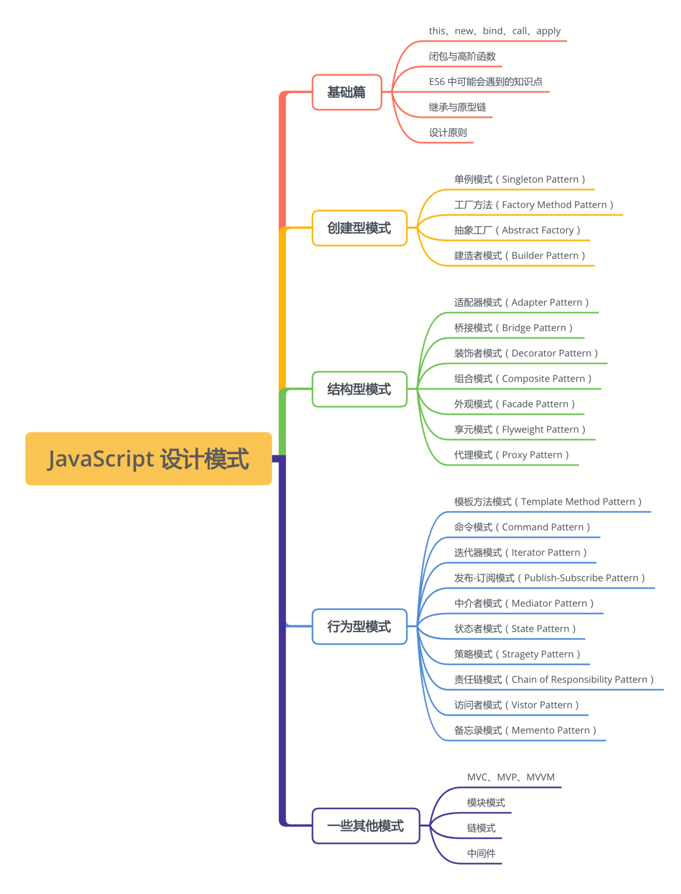

# 01 开篇 ｜ 为什么学习本专栏？

古之立大事者，不唯有超世之才，亦必有坚韧不拔之志。

——苏轼

1\. 什么是设计模式
-----------

小时候打游戏，我们总是追求最快通关；朋友聚会，我们会拿出手机查看哪家店离得近，而且实惠又好吃；下班回寝室，我们总是选最便捷的路线坐车。我们总是追求一件事最优美最便捷的解决方法，也就是**最佳实践**。

设计模式就相当于**武功秘籍**里面的招式，是先辈们总结出来的最佳实践，如果在遇到合适的场景时施展，则事半功倍，以后扩展和阅读都十分舒畅，如读诗行，如沐春风。然而招式运转在乎融会贯通、心领神会，臻至化境应当随心所欲、如臂使指，遇到合适的场景使用合适的招式，才是正道。如果生搬硬套、为了用而用，则会提升代码复杂度，反而让团队其他成员一脸懵，平白增加协作成本。

2\. 学习设计模式的目的
-------------

JavaScript 是多模式混合的，面向对象，以原型为基础，并拥有动态数据类型。一方面将函数看做一等公民，允许函数式编程的风格，另一方面，也不排斥传统的面向对象方式进行开发，甚至在之后的 ES6+ 的标准中引入了面向对象相关的一些原生支持。

这使得 JavaScript 成为功能十分强大的语言，赋予开发者很大的开发灵活性，但同时也导致编程风格、习惯以及技术的碎片化，进而导致同一个功能实现的多样化。这种情况下，对于这些传统的、强面向对象的设计模式会有各种类型的实现，有时候你甚至会觉得其中的某些有点牵强。

但是这些并不妨碍使用 JavaScript 来表达**设计模式的理念、它所要解决的问题，和它的核心思想**，这才是我们所要关注的核心。

因此并不是所有设计模式都是适合 JavaScript 的，我们需要注意一些比较常见的设计模式，比如工厂模式、单例模式、发布-订阅模式，而对于一些不那么常用的模式，则可以浅尝辄止，吸收其主要思想即可。

另外由于原型模式在 JavaScript 内建了，这里就不单独设置文章了。

3\. 主题文章设置与索引
-------------

本专栏的知识体系与大纲使用思维导图的形式整理如下：

 
专栏共 29 篇文章，分为 4 个部分：

#### 基础篇

在系统学习各设计模式之前，还需要先了解一下 JavaScript 学习离不开的基础知识，比如 this、闭包与高阶函数等相关知识，然后是面向对象风格相关的继承等知识，这些都是学习设计模式的铺垫。如果你已经对基础篇相关知识点已经很了解，那么可以跳过，如果你觉得不够了解，或者了解的还不完整，那么可以通过基础篇的文章来复习一下。

#### 创建型模式

创建型模式关注**如何创建对象**，主要特点是将对象的创建和使用分离。一般抽象了对象实例化的过程，用来帮助创建对象的实例。包括下面几个小节：

1.  单例模式： 保证一个类只有一个实例，并提供一个访问它的全局访问点；
2.  工厂模式： 根据输入的不同返回不同类的实例，一般用来创建同一类对象；
3.  抽象工厂模式： 通过对类的工厂抽象，使其业务用于对产品类簇的创建；
4.  建造者模式： 分步构建一个复杂对象，使得同样的构建过程可以采用不同的表示；

#### 结构型模式

结构型模式关注如何**将对象按某种布局组成更大的结构**。包括下面几个小节：

1.  代理模式： 为目标对象创造一个代理对象，以控制对目标对象的访问；
2.  享元模式： 运用共享技术来有效地支持大量细粒度对象的复用，减少创建的对象的数量；
3.  适配器模式： 解决两个软件实体间接口不兼容的问题；
4.  装饰者模式： 向一个现有的对象添加新的功能，同时又不改变其结构；
5.  外观模式： 为多个复杂的子系统提供一个一致的接口，使这些子系统更加容易被访问；
6.  组合模式： 用小的子对象构建更大的对象，使得对单个对象和组合对象具有一致的访问性；
7.  桥接模式： 将类的抽象部分与实现部分分离，使它们可以独立地变化；

#### 行为型模式

行为型模式关注**对象之间的通信**，描述对象之间怎样相互协作，以及怎样分配职责。包括下面几个小节：

1.  发布-订阅模式： 多个对象间存在一对多关系，当一个对象发生改变时，把这种改变通知给其他多个对象，从而影响其他对象的行为；
2.  策略模式： 定义了一系列算法，并将每个算法封装起来，使它们可以相互替换；
3.  状态模式： 允许一个对象在其内部状态发生改变时改变其行为能力；
4.  模板方法模式： 定义一个操作中的算法骨架，而将算法的一些步骤延迟到子类中，使得子类可以不改变该算法结构的情况下重定义该算法的某些特定步骤；
5.  迭代器模式： 提供一种方法来顺序访问聚合对象中的一系列数据，而不暴露聚合对象的内部表示；
6.  命令模式： 将一个请求封装为一个对象，使发出请求的责任和执行请求的责任分割开；
7.  职责链模式： 把请求从链中的一个对象传到下一个对象，直到请求被响应为止；
8.  中介者模式： 定义一个中介对象来简化原有对象之间的复杂耦合关系；

#### 一些其他模式

一些其他的模式。包括下面几个小节：

1.  MVC、MVP、MVVM： 用于系统分层，降低层间耦合；
2.  模块模式： 将内部的属性和方法隐藏，仅暴露需要暴露的部分；
3.  链模式： 通过在对象方法中将当前对象返回，实现对同一个对象的多个方法的链式调用；
4.  中间件： 处于操作系统和应用程序之间的软件，来完成对任何数据的预处理和后处理；
